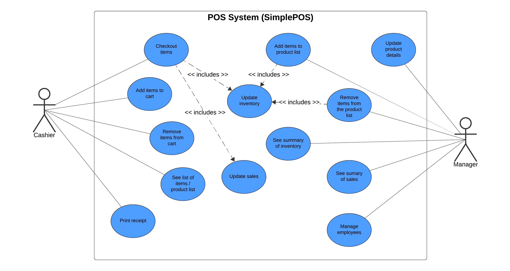
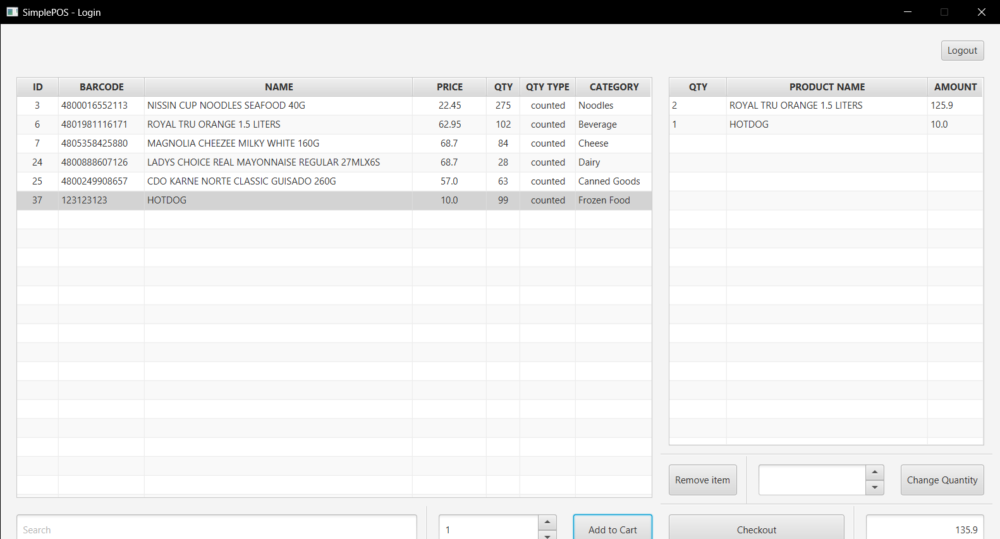
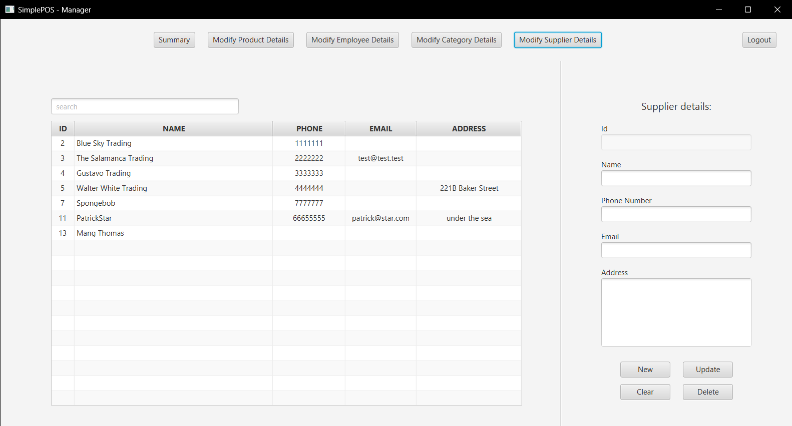

# SimplePOS
Simple POS system catered for small to medium enterprises.

*submitted to TESDA / TCSDI*

### Instructions
1. Import project as a Maven project (use Java 21)
2. Create a database using `SimpleposDump-241204.sql` and modify database configuration on `src/main/java/tesda/tcsdi/simplepos/model/dal/DatabaseUtil.java`
3. Run `src/main/java/tesda/tcsdi/simplepos/Main.java` or run `mvn package`

*Ensure Java 21+ is used when running the jar executable*

### Technologies
1. Java 21 (Temurin 21.0.5)
2. JavaFX
3. Maven
4. MySQL

### Use Case Diagram

### Sample Screenshots

